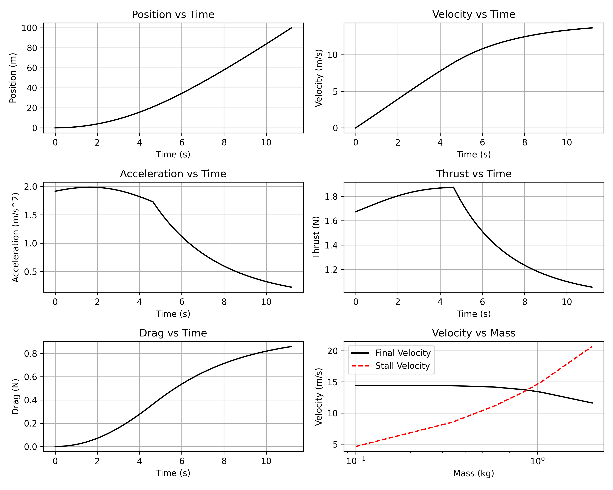

# Maximum Take-Off Mass Optimizer (MTOMO)

QPROP is an analysis program for predicting the performance of propeller-motor or windmill-generator combinations under a specific state setpoint, snapshot in time. This script takes a run configuration that represents a plane-environment-constraints scenario and performs an optimization for the Maximum Take-Off Mass (MTOM) by forking processes executing [Mark Drela's QPROP tool](https://web.mit.edu/drela/Public/web/qprop/). If the MTOM is found, plots for $x(t)$, $v(t)$, $a(t)$, $F_T(t)$, and $F_D(t)$ are generated for the successful run as well as a performance curve over the entire optimization.

## Requirements and Running

This script was written in Python `3.13.3` and may require a version that is close to run. The script also requires that several packages be installed, which can be conveniently done by running `pip install -r requirements.txt`, assuming no virtual environment is being used for packages. By default, the script utilizes all **logical processors** available on the system and requires a system with a central processing unit that boasts at least 4 logical processors. The script is run using the following command:

```bash
python main.py -c <config_json_path> [-p n_processes]
```

## Runs and Configurations

Each run configuration file represents a plane-environment-constraints scenario and thus the input to an optimization (run) over that scenario. The exact `json` structure of a run configuration file is shown below, where `|` delimits options. A run configuration file must consist of this exact structure.

```py
{
    "propeller_file": str,                                      # Path to propeller file
    "motor_file": str,                                          # Path to motor file
    "timestep_size": float | int,                               # Simulation time (s) step size
    "mass_range": [float | int, float | int],                   # Mass (kg) range to search
    "arithmetic_precision": None | int,                         # Arithmetic precision for tolerance
    "takeoff_displacement": float | int,                        # Displacement (m) at take-off
    "setpoint_parameters": {
        "velocity": None | float | int,                         # Initial velocity (m/s)
        "voltage": None | float | int,                          # Voltage (V)
        "dbeta": None | float | int,                            # Pitch-change angle (deg)
        "current": None | float | int,                          # Current (A)
        "torque": None | float | int,                           # Torque (N·m)
        "thrust": None | float | int,                           # Thrust (N)
        "pele": None | float | int,                             # Electrical Power (W)
        "rpm": None | float | int                               # RPM (rpm)
    },
    "aerodynamic_forces": {
        "fluid_density": None | float | int,                    # Fluid density (kg/m^3)
        "true_airspeed": None | float | int,                    # True airspeed (m/s)
        "drag_coefficient": None | float | int,                 # Drag coefficient
        "reference_area": None | float | int,                   # Reference area (m^2)
        "acceleration_gravity": None | float | int,             # Acceleration due to gravity (m/s^2)
        "lift_coefficient": None | float | int                  # Lift coefficient
    }
}
```

The `None` value, known as `null` in `json`, is used to indicate to the optimizer that we don't want to provide a value ourselves, instead letting the optimizer figure it out. For `arithmetic_precision`, `null` means the precision should be set to the default of 3. For `setpoint_parameters`, `null` means that the setpoint parameter should be initialized to the default of 0. For `aerodynamic_forces`, `null` means that the aerodynamic parameter should be initialized to the default of 0, except for three cases: for `acceleration_gravity` it is 9.81, for `lift_coefficient` it is 1.0, and for `true_airspeed` the optimizer should dynamically update the velocity to match the plane's current velocity at every step of the simulation.

Three parameters of the configuration work together to affect the duration and quality of the simulation: `timestep_size`, `mass_range`, and `arithmetic_precision`. The smaller the `timestep_size`, the more accurate the simulation output will be but the longer it will take. The tighter the `mass_range` is around the actual MTOM, the faster the simulation, but this requires prior knowledge or a ball-park estimate of the MTOM. As for the `arithmetic_precision`, it controls how much the optimizer should keep pushing for higher masses. A precision of 3 signifies that the nearest gram suffices.

## Example Use Case

> A plane boasts an `apc14x10e` propeller and a `CobraCM2217-26` motor. The plane must take off by $100\ m$. We seek a MTOM within the nearest gram. The voltage at full throttle is $8.40\ V$. Based on a similar plane, we expect the mass of the plane to be between $0.1\ kg$ and $2.0\ kg$ and its aerodynamic characteristics approximated to be $0.1$ for the drag coefficient, $1.0$ for the lift coefficient, and $0.075\ m^2$ for the reference area. Assume an air density of $1.225\ kg/m^3$, an acceleration due to gravity of $9.81\ m/s^2$, and variable drag.

For this problem, the configuration file should look something like the snippet shown below. We set `null` for `true_airspeed` to allow the optimizer to model variable drag, otherwise the drag will be constant. For the `timestep_size`, we should pick values based on our intuition. In this case, we think a `timestep_size` of $0.1\ s$ will suffice.

```json
{
    "propeller_file": "propeller_files/apc14x10e",
    "motor_file": "motor_files/CobraCM2217-26",
    "timestep_size": 0.1,
    "mass_range": [0.1, 2.0],
    "arithmetic_precision": null,
    "takeoff_displacement": 100.0,
    "setpoint_parameters": {
        "velocity": null,
        "voltage": 8.4,
        "dbeta": null,
        "current": null,
        "torque": null,
        "thrust": null,
        "pele": null,
        "rpm": null
    },
    "aerodynamic_forces": {
        "fluid_density": 1.225,
        "true_airspeed": null,
        "drag_coefficient": 0.1,
        "reference_area": 0.075,
        "acceleration_gravity": 9.81,
        "lift_coefficient": 1.0
    }
}
```

Running the optimization with the default flags on a machine with 4 logical processors displays the following final output and saves some dynamic analysis plots.

```bash
Optimizing for MTOW | Config[config]: m=[0.100, 2.000] kg ~ x=100.0 m | Elapsed: 00:16 | Epoch: 7
m = 0.877 kg [t = 11.20 s | x = 100.79 m | v = 13.69 m/s | a = 0.22 m/s^2 | T = 1.05 N | D = 0.86 N]
m = 0.878 kg [t = 11.20 s | x = 100.73 m | v = 13.69 m/s | a = 0.22 m/s^2 | T = 1.05 N | D = 0.86 N]
m = 0.879 kg [t = 11.20 s | x = 100.67 m | v = 13.68 m/s | a = 0.23 m/s^2 | T = 1.06 N | D = 0.86 N]
[WARNING] MTOM found may not be accurate: simulation timestep size (0.1) may be too large.
[INFO] STALL_VELOCITY = 13.685 m/s | MTOM = 0.877 kg | LIFTOFF_DISTANCE = 100.78822557094627 m
```

The output demonstrates the importance of the `timestep_size` value. Here, the optimizer is warning us that although a MTOM was found, it may not be accurate as it could only guarantee that the plane is at takeoff by $100.79\ m$, which is above the `takeoff_displacement` we specified. In order to improve our result, let's try decreasing the `timestep_size` to $0.01\ s$. As you can see from the output, the simulation took longer to complete and gave us a more accurate result.

```bash
Optimizing for MTOW | Config[config]: m=[0.100, 2.000] kg ~ x=100.0 m | Elapsed: 02:05 | Epoch: 7
m = 0.873 kg [t = 11.19 s | x = 100.11 m | v = 13.68 m/s | a = 0.22 m/s^2 | T = 1.05 N | D = 0.86 N]
m = 0.874 kg [t = 11.19 s | x = 100.05 m | v = 13.67 m/s | a = 0.22 m/s^2 | T = 1.05 N | D = 0.86 N]
m = 0.875 kg [t = 11.20 s | x = 100.12 m | v = 13.67 m/s | a = 0.22 m/s^2 | T = 1.05 N | D = 0.86 N]
[WARNING] MTOM found may not be accurate: simulation timestep size (0.01) may be too large.
[INFO] STALL_VELOCITY = 13.670 m/s | MTOM = 0.875 kg | LIFTOFF_DISTANCE = 100.12313879561361 m
```

We've gotten closer, but it seems like decreasing `timestep_size` by the same factor would result in the simulation taking unreasonably long for the amount of benefit remaining to be gained. We could've set the timestep size to $0.001\ s$ from the beginning and left the thing running. But given our current situation, we have other options. We could reduce the `takeoff_displacement` specified in the configuration file to artificially limit the optimizer so that when it does exceed the specified displacement, it is still below $100\ m$. Or we could make the observation that the masses obtained from timestep sizes $0.1\ s$ vs $0.01\ s$ were $0.877\ kg$ vs $0.875\ kg$. And given the 2 gram difference between the two results as well as how close the final recorded liftoff distance was to our configured takeoff displacement, we could estimate that a further 2 gram reduction is safe enough, picking $0.873\ kg$ for what we expect to be the MTOM for a takeoff displacement of exactly $100\ m$. For your convenience, here's the $0.001\ s$ timestep size run. As you can tell, our previous result turned out to be optimal, though our estimate wasn't far behind. But more importantly, we were on the safe side with our estimate.

```bash
Optimizing for MTOW | Config[config]: m=[0.100, 2.000] kg ~ x=100.0 m | Elapsed: 46:13 | Epoch: 13
m = 0.875 kg [t = 11.20 s | x = 100.01 m | v = 13.67 m/s | a = 0.22 m/s^2 | T = 1.05 N | D = 0.86 N]
m = 0.875 kg [t = 11.20 s | x = 100.01 m | v = 13.67 m/s | a = 0.22 m/s^2 | T = 1.05 N | D = 0.86 N]
m = 0.875 kg [t = 11.20 s | x = 100.01 m | v = 13.67 m/s | a = 0.22 m/s^2 | T = 1.05 N | D = 0.86 N]
[WARNING] MTOM found may not be accurate: simulation timestep size (0.001) may be too large.
[INFO] STALL_VELOCITY = 13.667 m/s | MTOM = 0.875 kg | LIFTOFF_DISTANCE = 100.01004340926012 m
```

The graphs below were obtained from the $0.001\ s$ timestep size run. The bottom-right graph in particular provides a summary of the optimization. The point of intersection of the final velocity and stall velocity curves represents the point beyond which the stall velocity begins to exceed the final velocity, where the mass of the plane leaves it unable to take off by the takeoff displacement.

<div style="text-align: center;">
    
</div>

## Project Structure

This section outlines the structure of the project for documentation purposes, in case future patches must be applied.

```bash
MaximumTakeOffMassOptimizer/                    # Project root
├── components/                                 # Python script components
│   ├── utils/                                  # Python script utilities
│   │   ├── config_structure.py                 # Used to define and verify config structure
│   │   ├── process_statuses.py                 # Used to define process status enums
│   │   └── result_states.py                    # Used to define result state enums
│   ├── ConstantMassDynamicsModel.py            # Used by a worker to represent its results
│   ├── ConstantMassDynamicsSimulation.py       # Represents a QPROP (worker) process
│   ├── MaximumTakeOffMassOptimizer.py          # Represents the optimizer (main) process
│   └── RunConfiguration.py                     # Validates and encapsulates a run configuration
├── docs/                                       # Files referenced in documentation
│   └── readme.png                              # Image referenced in the README
├── motor_files/                                # Motor files
│   └── ...
├── propeller_files/                            # Propeller files
│   └── ...
├── .gitignore                                  # Gitignore file
├── LICENSE                                     # LICENSE file
├── main.py                                     # Main file of the script
├── qprop.exe                                   # QPROP executable dispatched by the script
├── README.md                                   # README file
└── requirements.txt                            # Package requirements file
```

## Algorithm Analysis

Let $Q(C, v)$ denote a simplified interface of the QPROP function, which takes a run configuration $C$ and a current velocity $v$. A single forked process is assigned a specific mass, running several $Q$ functions in succession, each using a velocity calculated using information from the previous $Q$ function execution, to build the takeoff dynamic characteristics of the plane. We use $\mathcal{T}(C, m)$ to denote the task function of a forked process, one that would build the takeoff dynamic characteristics of the plane assuming mass $m$ and given run configuration $C$. Knowing that $\mathcal{T}$ is monotonically increasing with respect to mass, thus implying that the output of $N$ processes receiving from a sorted list of masses will be sorted, binary search can be used to narrow down the search until a solution within some tolerance $\delta = 10^{-p}$ is reached. The elaborated worst-case time complexity of this solution is $O(log_2(\frac{R}{10^{-p}})\cdot\frac{1}{\Delta t})$, where $R$ is the difference between the maximum and minimum mass values, $p$ is the arithmetic precision, and $\Delta t$ is the timestep size.

The solution implemented in the script is an improvement over binary search, as it utilizes a parallel n-interval (i.e. n-ary) search, where $n = N+1$ and $N$ is the number of forked processes passed to the script. When using binary (2-ary) search, 1 midpoint is evaluated, splitting the search space into $\frac{1}{2}$ of its size after every epoch ($log_2$ asymptotic behavior). When using parallel n-ary search, $N = n-1$ midpoints are evaluated in parallel, with their results being used to split the search space into $\frac{1}{n}$ of its size after every epoch ($log_n$ asymptotic behavior). This solution is highly effective for the optimizer because a single process running $\mathcal{T}$ can take several minutes under low tolerances. Parallelizing the search and increasing the number of midpoints effectively reduces the number of epochs by a factor of $log_2(N+1)$ compared to binary search.
